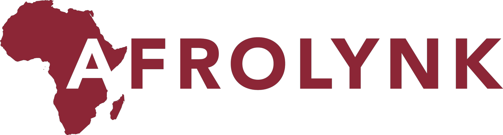

## About this repo

Welcome to the Factory24 Github organization page, this repo is used as an index for several purposes:

1. To provide overview of the Factory24 project
2. To provide a "sitemap" for the organization repos and activities
3. To hightlight the Factory24 OSS contributing guidelines

### Afrolynk's Factory24 Overview

With the increasing applications of technology in our daily lives, there has been a corresponding demand 
for skilled software engineers in Africa revolving areas involving mobile development and data science. 
With their existing knowledge, Afrolynk guides the entrepreneurs to take that step further and bridge this 
gap with the help of Factory24.

Factory24 is a stimulus to young entrepreneurs in Africa through bootcamps & training by offering mentoring 
sessions and workshops but also create a platform for these entrepreneurs to be exposed in an environment to 
meet potential employers.

we're currently developing to build next Gen Tech Entrepreneurs in 8 African countries including Tunisia, Ghana,
Kenya, Zimbabwe, Nigeria, Uganda etc.

### Sitemap

This organization page will host a variety of repositories including project specifications & software releases. 
Nothing in this sitemap is `permanent` yet. The most important `repos` for now cover three separate guidelines: 

* [Project Submission Guide](https://github.com/factory24/project-submission) - complete guideline of how to submit
    project ideas including templates and step-by-step instructions. 
* [Improvement Proposal Guide](https://github.com/factory24/improvement-proposals) - repository for the Factory24 
    improvement proposals and standard processes.
* [Course Directory](https://github.com/factory24/course-directory) - complete outline of all courses provided on 
    Factory24 platform, breakdown of course objectives and guide to raising issues. 

These guidelines will remain as `drafts.` Most of the improvement work will happen in the `issues` or in `active pull 
requests` so if you have ideas to make getting started with Open Source contributing at Factory24 very friendly, go 
take a look!

### Contributing Guidelines

Out of the multiple projects we're building, about 60% are built on public repositories on Github, released under 
`OSI-approved` licenses like the `MIT License`, the `GNU General Public License` and `Apache License 2.0`.  This 
ensures that developers who have completed any of our courses can almost immediately start contributing by reviewing 
code, creating pull requests and making commits.  Essentially turning contributors to maintainers and a community.

The technical model we will be replicating on all our projects is covered in our **[Contributing Guide](https://github.com/factory24/contributing-guide)** which outlines our contributing guidelines, code of conduct, best practises for maintainers, our 
community profile and so much more. 

## License

All software code is copyright (c) Afrolynk under the **MIT license**.

